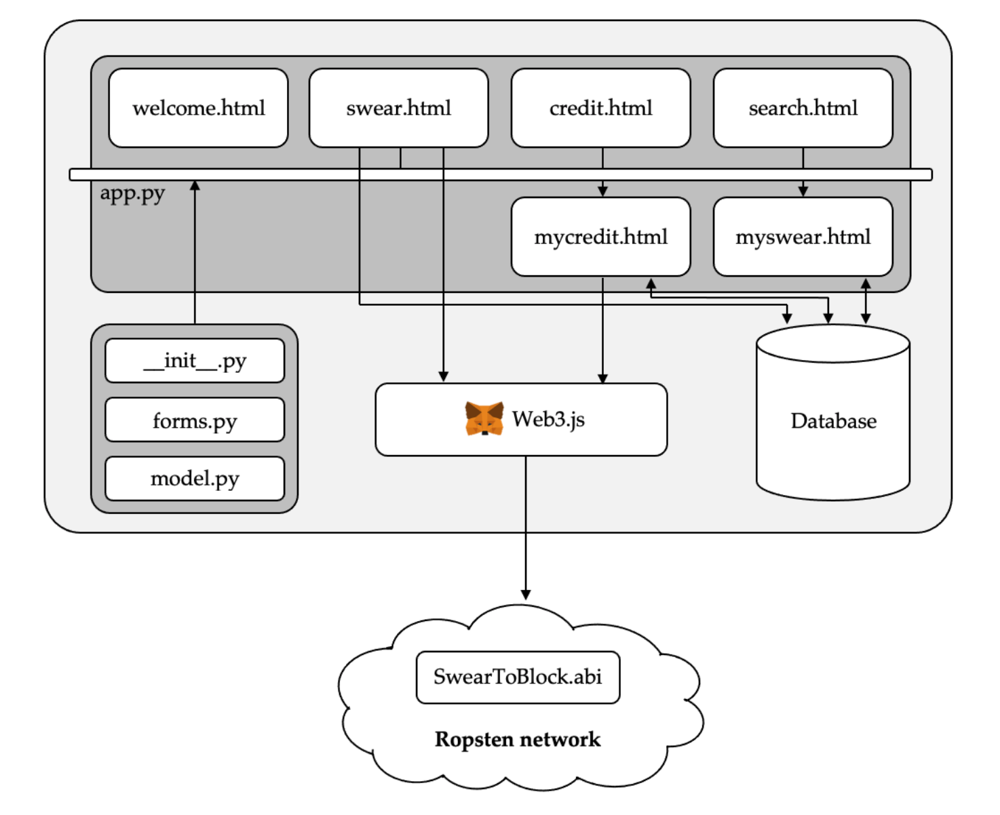

# Swear 2 Block (S2B)

This is a blockchain smart contract example.

We used ***Remix - Ethereum IDE*** for the smart contract (```.sol```), then deployed it on ***Ropsten test net***.

***Metamask*** and ***Uniswap*** are both used for demonstration as well.

The structure is as follows:
<br>


## Run
1. Make sure you have ***Metamask*** running (usually with chrome).

2. Buy some ether with the Metamask test faucet (done by the Metamask plugin).

2. Copy the ```./S2B_smart_contract``` to ***Remix - Ethereum IDE***, then deplyed it on ***Ropsten test net***.

3. Then get the smart contract address, and modify the <script> **ConAddr = {address}** </script> in ```./utils/templates/swear.html```.

4. Now go to [Uniswap](https://app.uniswap.org/#/swap?chain=mainnet) and swap some s2b coins with the ether bought earlier.

5. Finally run the client-side app.

```
python3 app.py
```
